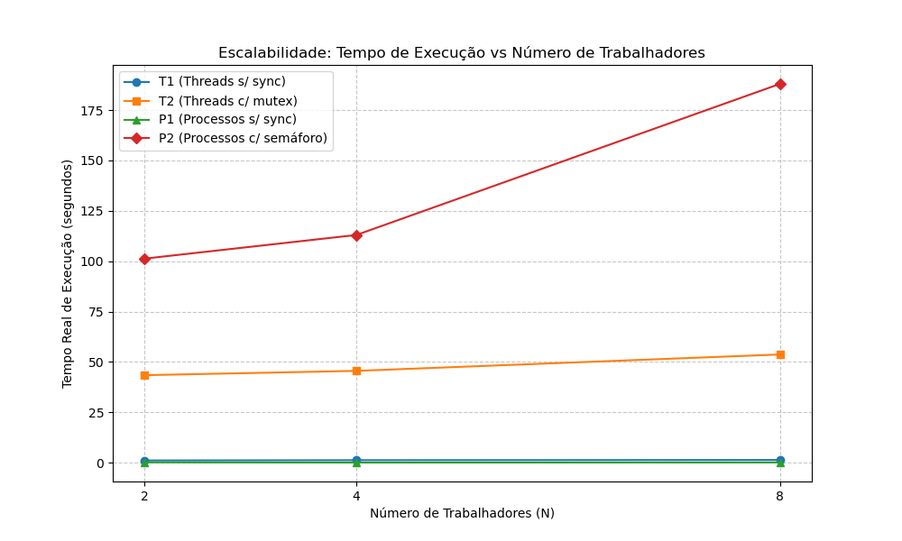

# O Duelo de Contextos (Processos vs. Threads)

Integrantes: Bruno Coliselli, Enrico Pheula, Gustavo Losch e Vitor Britz

## 1. Objetivo

O objetivo deste trabalho é realizar um experimento exploratório comparando o overhead de criação, o custo de comunicação e a consistência de dados entre Processos (padrão POSIX fork) e Threads (padrão POSIX pthreads) em ambiente Unix. O problema consiste em incrementar um contador global até o valor de 1.000.000.000 (um bilhão), distribuindo o esforço entre N unidades de execução (onde N = 2, 4 e 8).

## 2. Assinatura do Hardware

```text
Arquitetura: x86_64
CPUs: 20
Modelo: 13th Gen Intel(R) Core(TM) i7-13650HX
Sistema Operacional: Ubuntu 24.04
```

## 3. Instruções de Utilização

Para compilar os experimentos, acesse o [Makefile](/Makefile) e altere o parâmetro `CC` para o seu compilador (por exemplo, `clang` para Mac, `gcc` para Linux, etc.). Em seguida, rode o seguinte comando:

```bash
make
```

Para rodar os experimentos, verifique o parâmetro `CPU_CORES` nos scripts [run_partA.sh](/ColliCF/Billion-Increment-War/blob/fix/partb_to_csv/run_partA.sh) e [run_partB.sh](/ColliCF/Billion-Increment-War/blob/fix/partb_to_csv/run_partB.sh). Para Mac, utilize `sysctl -n hw.ncpu`, enquanto para Linux, utilize `nproc`. Inicie com o comando:

```bash
make benchmark
```

Os resultados dos experimentos serão salvos no arquivo `results.csv`.

## 4. Tabela de Tempos

A tabela abaixo apresenta os tempos reais de execução (em segundos) obtidos através do comando `time`, variando o número de trabalhadores (N) para cada um dos quatro cenários:

| Cenário | Sincronização | API Utilizada | Tempo (N=2) | Tempo (N=4) | Tempo (N=8) |
| :--- | :--- | :--- | :--- | :--- | :--- |
| **T1 (Threads)** | Nenhuma | pthreads | 1.13 s | 1.27 s | 1.38 s |
| **T2 (Threads)** | Mutex | pthread_mutex | 43.44 s | 45.58 s | 53.71 s |
| **P1 (Processos)** | Nenhuma | shm + fork | 0.19 s | 0.09 s | 0.15 s |
| **P2 (Processos)** | Semáforos | sem_open + shm | 101.27 s | 113.00 s | 187.98 s |

## 5. Análise de Corrupção

Nos experimentos **T1** e **P1**, o valor esperado era de 1 bilhão. No entanto, os resultados reais obtidos foram:

* **T1 (Threads):**
  * N=2: 502.774.241
  * N=4: 256.883.467
  * N=8: 199.798.420
* **P1 (Processos):**
  * N=2: 504.140.916
  * N=4: 264.625.804
  * N=8: 256.127.022

**Explicação do Erro:**

Nos cenários sem sincronização (T1 e P1), os contadores ficaram muito abaixo do bilhão esperado, atingindo valores finais entre 199 milhões e 504 milhões. Essa falha ocorre devido a uma condição de corrida clássica, pois o incremento de uma variável não é uma operação atômica em nível de hardware, consistindo em pequenas etapas separadas de leitura, adição e gravação. Sem mecanismos de exclusão mútua, os trabalhadores que estão rodando simultaneamente leem o mesmo valor base nos registradores e sobrescrevem o progresso uns dos outros na memória, causando a perda sistemática de milhões de incrementos.

## 6. Gráfico de Escalabilidade

Abaixo está o gráfico comparativo do tempo de execução versus o número de trabalhadores (N):



## 7. Conclusão

Avaliando a eficiência na comunicação e sincronização, o modelo baseado em Threads demonstrou desempenho significativamente superior ao de Processos. A utilização de mecanismos de sincronizão para threads exigiu tempos na faixa de quarenta a cinquenta segundos, enquanto a combinação de semáforos com memória compartilhada para processos ultrapassou os cem segundos em todos os cenários. Essa diferença ocorre porque as threads compartilham nativamente o mesmo espaço de endereçamento e utilizam operações de bloqueio rápidas no espaço de usuário, enquanto os processos exigem transições custosas a cada bloqueio e liberação de recurso compartilhado.

Quanto ao overhead de criação, o modelo de Processos impõe a maior carga ao sistema operacional por definição arquitetural. Iniciar um processo exige a duplicação de estruturas de controle, o mapeamento de novas tabelas de páginas e o estabelecimento de uma região de memória interprocessos. Em contrapartida, iniciar threads é um procedimento consideravelmente mais leve, limitando-se a alocar uma nova pilha e um bloco de controle reduzido, o que reaproveita todo o contexto do programa principal, constituindo uma opção menos custosa.

Em suma, as abordagens sem sincronismo (T1 e P1) revelaram que, embora a velocidade de execução seja ótima, ocorre forte inconsistência nos dados em arquiteturas multicore, inviabilizando sua aplicação quando a exatidão das variáveis compartilhadas é fundamental.
